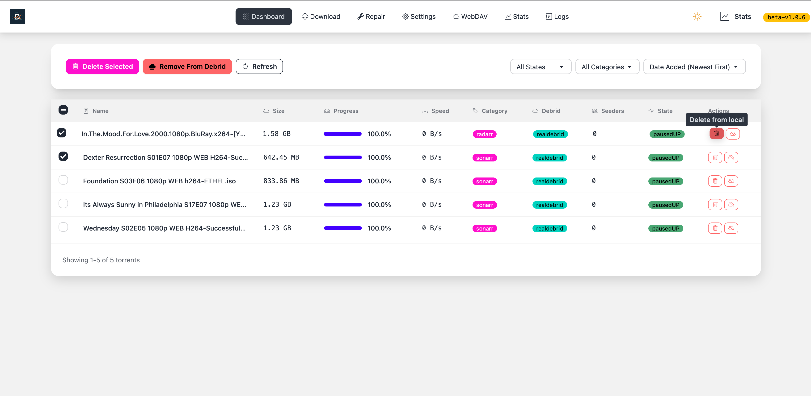
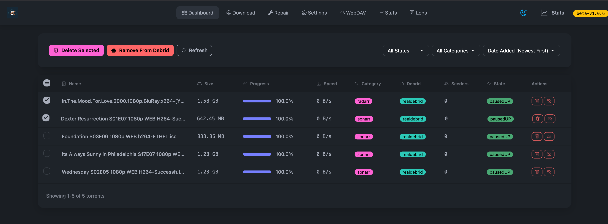

# Decypharr
{: .light-mode-image}
{: .dark-mode-image}

**Decypharr** is a qBittorrent-compatible download client with **multiple Debrid service support**.
This repository provides the Python implementation, inspired by the original Decypharr project.

## What is Decypharr?

**TLDR**; Decypharr is a self-hosted, open-source download client that integrates with multiple Debrid services. It provides a user-friendly interface for managing files and supports popular media management applications like Sonarr and Radarr.

## Key Features

- Mock qBittorrent API that supports Sonarr, Radarr, Lidarr, and other Arr applications
- Multiple Debrid providers support
- WebDAV server support for each Debrid provider with an optional mounting feature(using [rclone](https://rclone.org))
- Repair Worker for missing files, symlinks etc

## Supported Debrid Providers

- [Real Debrid](https://real-debrid.com)
- [Torbox](https://torbox.app)
- [Debrid Link](https://debrid-link.com)
- [All Debrid](https://alldebrid.com)

## Getting Started

Check out our [Installation Guide](installation.md) to get started with Decypharr. See [Feature Status](port-status.md) for current coverage, or the Developer Guide if you're contributing.

## Original Project (Acknowledgement)

Decypharr was originally created by Mukhtar Akere. This Python implementation exists thanks to that work.

- Original project: [sirrobot01/decypharr](https://github.com/sirrobot01/decypharr)
- Original documentation: [sirrobot01.github.io/decypharr](https://sirrobot01.github.io/decypharr/)
