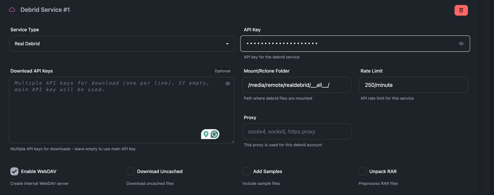
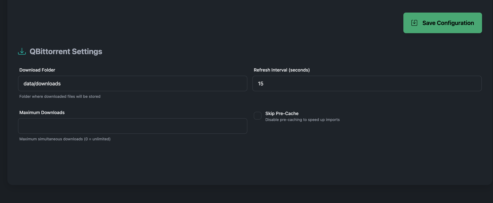
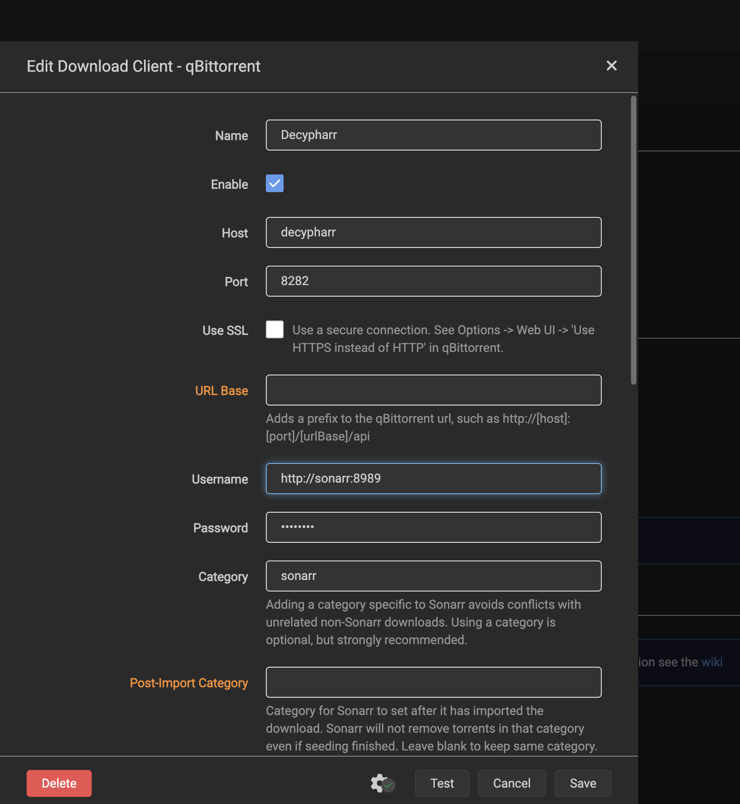
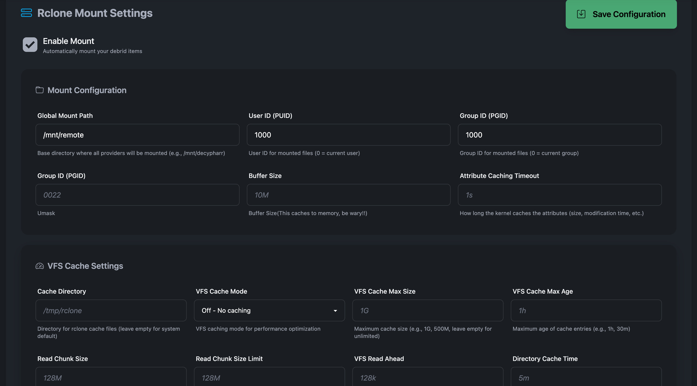
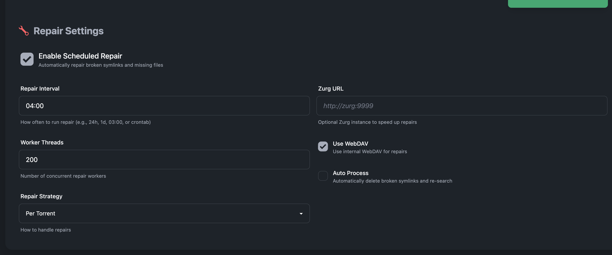

# Usage Guide

This guide will help you get started with Decypharr after installation.

After installing Decypharr, you can access the web interface at `http://localhost:8282` or your configured host/port.

### Initial Configuration
If it's the first time you're accessing the UI, you will be prompted to set up your credentials. Enter a username and password, confirm the password, then click **Save**. You will be redirected to the settings page. After bootstrap, credential changes require an authenticated session.

### Debrid Configuration
   
- Click on **Debrid** in the tab
- Add your desired Debrid services by entering the required API keys or tokens. The Python port currently implements Real Debrid and Torbox. Debrid Link and All Debrid remain planned work.
- Set the **Mount/Rclone Folder**. This is where decypharr will look for added torrents to symlink them to your media library.
   - If you're using internal webdav, do not forget the `/__all__` suffix
- Enable WebDAV
- You can leave the remaining settings as default for now.

### qBittorrent Configuration
   

- Click on **Qbittorrent** in the tab
- Set the **Download Folder** to where you want Decypharr to save downloaded files. These files will be symlinked to the mount folder you configured earlier.
- Set **Default Action** to control what Decypharr does when a torrent completes:
  - **Symlink**: Fast and uses the debrid WebDAV/rclone mount. Best on Linux.
  - **Download**: Copies files into the download folder (best on Docker Desktop/macOS/Windows).
  - **None**: Do not materialize files (metadata only).
- Set **Always Remove Tracker URLs** if you want to always remove the tracker URLs from torrents and magnet links. This is useful if you want to [download private tracker torrents](features/private-tracker-downloads.md) without breaking the rules, but will make uncached torrents always stall.
You can leave the remaining settings as default for now.

### Torrent States

Decypharr exposes a qBittorrent-compatible API to Arr apps and the UI. The dashboard and API will show these states:

- **downloading**: The debrid provider is processing the torrent or the file materialization is in progress.
- **pausedUP**: Completed (and ready for import). This is the “completed” equivalent in qBittorrent.
- **error**: The debrid provider reported a failure state (e.g., magnet error, dead, virus).

Notes:
- When a debrid torrent reports `downloaded`/`completed`, Decypharr sets `pausedUP`.
- Arr apps may still show a download as “downloading” until the completed state is returned by the qBittorrent API.

### Arrs Configuration

You can skip Arr configuration for now. Decypharr will auto-add them when you connect to Sonarr or Radarr later.

Optional toggles:
- **Cleanup Queue**: Remove stalled/failed import items from the Arr queue automatically.
- **Auto-Remove Completed**: Once Arr imports a completed download and it disappears from the Arr queue, Decypharr removes it from its own torrent list.
- **Skip Repair**: Exclude a configured Arr instance from repair jobs.

#### Connecting to Sonarr/Radarr

To connect Decypharr to your Sonarr or Radarr instance:

1. In Sonarr/Radarr, go to **Settings → Download Client → Add Client → qBittorrent**
2. Configure the following settings:
   - **Host**: `localhost` (or the IP of your Decypharr server)
   - **Port**: `8282` (or your configured qBittorrent port)
   - **Username**: `http://sonarr:8989` (your Arr host with http/https)
   - **Password**: `sonarr_token` (your Arr API token, you can get this from Sonarr/Radarr settings)
   - **Category**: e.g., `sonarr`, `radarr` (match what you configured in Decypharr)
   - **Use SSL**: `No`
   - **Sequential Download**: `No` or `Yes` (if you want to download torrents locally instead of symlink)
   - **First and Last First**: `No` by default or `Yes` if you want to remove torrent tracker URLs from the torrents. This can make it possible to [download private trackers torrents without breaking the rules](features/private-tracker-downloads.md).
3. Click **Test** to verify the connection
4. Click **Save** to add the download client

If app authentication is enabled, the web UI uses sessions and the API also accepts `Authorization: Bearer <api_token>` for programmatic access.

### Rclone Configuration

If you want Decypharr to automatically mount WebDAV folders using Rclone, you need to set up Rclone first:

If you're using Docker, the rclone binary is already included in the container. If you're running Decypharr directly, make sure Rclone is installed on your system. Decypharr manages rclone internally and will start/stop mounts automatically when enabled.

Enable **Mount**
  - **Global Mount Path**: Set the path where you want to mount the WebDAV folders (e.g., `/mnt/remote`). Decypharr will create subfolders for each Debrid service. For example, if you set `/mnt/remote`, it will create `/mnt/remote/realdebrid`, `/mnt/remote/torbox`, etc. This should be the grandparent of your mount folder set in the Debrid configuration.
  - **User ID**: Set the user ID for Rclone mounts (default is gotten from the environment variable `PUID`).
  - **Group ID**: Set the group ID for Rclone mounts (default is gotten from the environment variable `PGID`).
  - **Buffer Size**: Set the buffer size for Rclone mounts.

You should set other options based on your use case. If you don't know what you're doing, leave it as defaults. Checkout the [Rclone documentation](https://rclone.org/commands/rclone_mount/) for more details.

### Repair Configuration

Repair is an optional feature that allows you to fix missing files, symlinks, and other issues in your media library.
- Click on **Repair** in the tab
- Enable **Scheduled Repair** if you want Decypharr to automatically check for missing files at your specified interval.
- Set the **Repair Interval** to how often you want Decypharr to check for missing files (e.g 1h, 6h, 12h, 24h, you can also use cron syntax like `0 0 * * *` for daily checks).
- Enable **WebDAV** (you should enable this if you enabled WebDAV in Debrid configuration)
- **Auto Process**: Enable this if you want Decypharr to automatically process repair jobs when they are done. This could delete the original files, symlinks, be wary!!!
- **Worker Threads**: Set the number of worker threads for processing repair jobs. More threads can speed up the process but may consume more resources.
